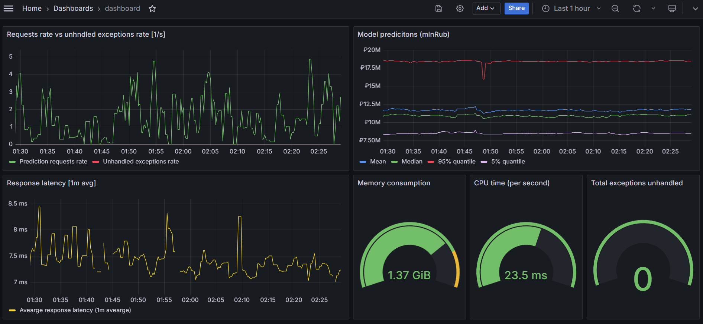

# Мониторинг

## Общий вид оформленного дашборда

### Для мониторинга работы сервиса выбраны следующие метрики

**Инрфраструткурные**

Показывают потребление системных ресурсов:
  - Объем виртуальной памяти `process_virtual_memory_bytes{instance="fastapi_app:7000"}`
  - Использование процессорного времени (в секунду) `rate(process_cpu_seconds_total[1m])`

**Прикладные:**

Показывают нагрузку на сервис, задержку (latency) и наличие внутренних ошибок при предсказании:
- Частота входящих запросов (кол-во запросов в секунду) `rate(http_requests_total{handler="/predict"}[1m])`
- Среднее время ответа (latency) `increase(http_request_duration_seconds_sum{handler="/predict"}[1m]) /    increase(http_request_duration_seconds_count{handler="/predict"}[1m])`
- Количество внутренних ошибок (unhandled exceptions) `app_prediction_exception_counter_total` и их частота (кол-во ошибок в секунду) `rate(app_prediction_exception_counter_total{}[1m])`

**Бизнес-метрики:**

Позволяют визуально оценить изменение статистик предсказания во времени:
- Скользящее среднее значение `delta(app_prediction_values_sum[5m]) / delta(app_prediction_values_count[5m])` и скользящие 5%,50% и 95% квантили предсказания `histogram_quantile(0.5, delta(app_prediction_values_bucket[5m]))`

Сохраненный дашборд находтся в файле `dashboards/dashboard.json`
